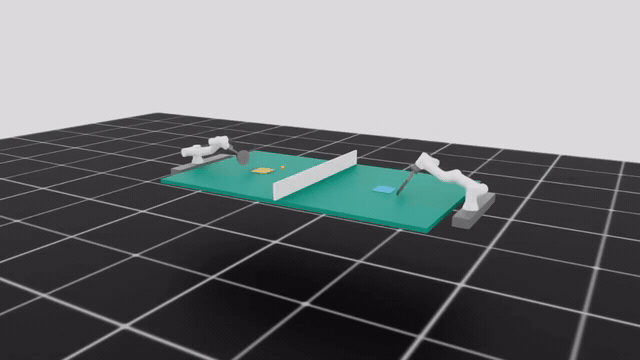

# 🏓 Fairino3 双臂乒乓球对打 — 强化学习项目

> 哈尔滨工业大学 大创项目 | NVIDIA Isaac Lab + RSL RL PPO

## Demo 演示



## 项目概述

使用 **NVIDIA Isaac Lab** 仿真平台训练 **Fairino3 工业机械臂** 打乒乓球。最终目标是两个 7-DOF 机械臂（左臂+右臂）持续对打（rally）。

### 项目演进

```
6-DOF 固定底座 (legacy) → 7-DOF + 导轨 (左臂) → 7-DOF 右臂 → 双臂对打
```

| 阶段 | 内容 | 成果 |
|------|------|------|
| **Legacy 6-DOF** | 固定底座，6个旋转关节 | 40.7% clean_right，36.4% illegal_second |
| **Rail 7-DOF 左臂** ★ | 增加 Y 轴 prismatic joint | **97%** clean_right，0% illegal second |
| **Rail 7-DOF 右臂** | 镜像左臂配置，面向 -X | 84% 训练成功率，视觉完美 |
| **双臂对打 (Dual)** | 双独立 MLP + 共享 distribution | Rally 初步实现，持续优化中 |

## 核心技术栈

| 层面 | 技术 |
|------|------|
| 仿真引擎 | NVIDIA Isaac Sim (PhysX) |
| RL 框架 | Isaac Lab ManagerBasedRLEnv |
| RL 算法 | RSL RL PPO (Actor-Critic) |
| 机器人 | Fairino3 工业臂 (URDF → USD) |
| 动作空间 | 7-DOF: rail_y (scale=0.04) + j1–j6 (scale=0.28) |

## 关键设计

- **`legal_post_hit_mask()`** — 门控所有 post-hit 奖励，防止 illegal second hit 获得正向奖励
- **镜像奖励函数** — `_make_arm_rewards()` 通过 `home_side` 参数生成左右对称奖励
- **opponent_compatible 奖励** — 回球适配对手训练分布，提升 rally 成功率
- **angular_damping=0.05** — 物理抑制球旋转，提升击球稳定性

## 仓库结构

```
Fairino3-PingPong-RL/
├── checkpoints/          # 训练好的模型权重 (.pt)
├── videos/               # 演示视频
├── graph/                # 评估图表和实验数据
└── handoff_to_hermes_2026-07-07/  # 项目文档
    ├── 01_PROJECT_OVERVIEW.md     # 项目总览
    ├── 03_BEST_CHECKPOINTS.md     # 最佳模型记录
    ├── 04_KEY_LEARNINGS.md        # 关键经验教训
    └── 05_COMMANDS_REFERENCE.md   # 命令参考
```

## 环境

- **OS:** Ubuntu Linux 6.8
- **GPU:** NVIDIA (Isaac Sim 依赖)
- **Python:** Conda env `env_isaaclab`
- **Isaac Lab:** NVIDIA Isaac Lab

## License

MIT
