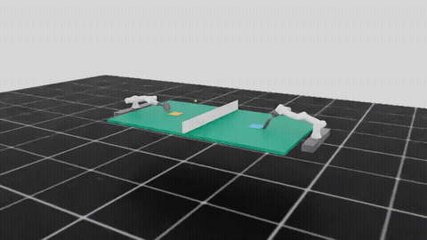

# Fairino3 双臂乒乓球对打 —— 强化学习

让两台 **7 自由度 Fairino3 机械臂** 在 NVIDIA Isaac Lab 仿真里，通过强化学习（PPO）学会**持续对打乒乓球**——球在两边台面之间来回弹跳的次数越多越好。

不靠人工写死"这一拍该用什么角度、多大力度"，而是用奖励函数引导机器人自己反复试错、逐步学会正确的回球动作。



> 三个随机种子的完整回放：[seed 42](videos/merged_BC_L999_R999_seed42.mp4) · [seed 123](videos/merged_BC_L999_R999_seed123.mp4) · [seed 456](videos/merged_BC_L999_R999_seed456.mp4)

---

## 成果

| 指标 | 旧版本 (v9) | 本项目最终配方 | 变化 |
|------|:---:|:---:|:---:|
| 左臂单臂落台率 | ~37.6% | **74.95%** | 翻倍 |
| 右臂单臂落台率 | ~19.5% | **69.03%** | 3.5× |
| 双臂对打成功率（成功>0 回合） | 35.3% | **36.60%** | +1.3pp |
| 双臂连续 ≥2 回合 | 11.6% | 11.29% | 持平 |
| 双臂最多连续回合 | 4 | **5** | +1 |

口径说明：单臂落台率 = 回球成功落在对手台面的比例（训练日志统计）；双臂成功率在 256 个并行场景 × 2000 步、1798 个回合上评估（`scripts/eval_rally.py`），"成功>0 回合"指整个回合至少完成 1 次交换。

---

## 项目结构

```
├── source/
│   ├── test_isaac_rail/        # 单臂训练包（左臂 + 右臂任务）
│   ├── test_isaac_rail_right/  # 右臂独立训练包
│   └── test_isaac_dual/        # 双臂对打包（DualArmActor）
├── scripts/
│   ├── train.py                # 双臂训练 / 单臂权重合并
│   ├── train_single_arm_left.py    # 左臂单臂训练
│   ├── train_single_arm_right.py   # 右臂单臂训练
│   ├── play.py                 # 推理可视化
│   ├── eval_rally.py           # 双臂 rally 评估
│   ├── eval_merged.py          # 合并模型逐回合评估
│   └── eval_single_checkpoints.py  # 单臂落台率评估
├── checkpoints/                # 最终配方模型权重
│   ├── left_scratch_bc_999.pt      # 左臂（落台 74.95%）
│   ├── right_scratch_bc_999.pt     # 右臂（落台 69.03%）
│   └── merged_BC_L999_R999.pt      # 双臂合并（rally 36.60%）
├── configs/                    # 训练时的完整配置快照（复现用）
├── videos/                     # 演示视频
└── docs/                       # 结题报告、配图、调参流程图、关键经验教训
```

---

## 环境要求

| 组件 | 版本 |
|------|------|
| Isaac Sim | 4.5.0 |
| Isaac Lab | 0.54.3 |
| Python | ≥ 3.10 |
| RSL-RL | 3.0.1（Isaac Lab 内置） |
| GPU | NVIDIA（Isaac Sim 依赖） |

> Isaac Lab 0.54.x 对应 Isaac Sim 4.5.0，版本必须匹配。

---

## 安装

在 Isaac Lab workspace 的 Python 环境中，依次安装三个扩展包：

```bash
./isaaclab.sh -p -m pip install -e source/test_isaac_rail
./isaaclab.sh -p -m pip install -e source/test_isaac_rail_right
./isaaclab.sh -p -m pip install -e source/test_isaac_dual
```

---

## 复现

### 1. 推理（加载 checkpoint 看 demo）

双臂对打（合并 checkpoint，纯推理）：

```bash
python scripts/play.py \
  --task Fairino3-PingPong-Dual-Centerline-v0 \
  --checkpoint checkpoints/merged_BC_L999_R999.pt \
  --num_envs 1 --real-time
```

单臂击球（左臂）：

```bash
python scripts/play.py \
  --task Fairino3-PingPong-Rail-Centerline-v0 \
  --checkpoint checkpoints/left_scratch_bc_999.pt \
  --num_envs 1 --real-time
```

### 2. 单臂训练（从头复现）

两个单臂模型均从零开始训练（4096 并行环境 × 1000 轮迭代，seed 42）。完整配置见 `configs/single_arm_left/` 与 `configs/single_arm_right/`（训练时 dump 的确切参数快照）。

```bash
# 左臂
python scripts/train_single_arm_left.py \
  --task Fairino3-PingPong-Rail-Centerline-v0 \
  --num_envs 4096 --max_iterations 1000 --seed 42 --headless

# 右臂
python scripts/train_single_arm_right.py \
  --task Fairino3-PingPong-Rail-Right-Centerline-v0 \
  --num_envs 4096 --max_iterations 1000 --seed 42 --headless
```

### 3. 双臂合并

双臂策略**不额外训练**——把两个训练好的单臂 actor 分别加载进 `DualArmActor` 的左右两个 MLP，合并后直接用于对打推理（这也是为什么合并 checkpoint 只含 actor 权重、不含 critic）。

```bash
python scripts/train.py \
  --task Fairino3-PingPong-Dual-Centerline-v0 \
  --pretrained_checkpoint checkpoints/left_scratch_bc_999.pt \
  --right_pretrained_checkpoint checkpoints/right_scratch_bc_999.pt \
  --num_envs 16
```

---

## 核心技术设计

### 状态机门控（`mdp/_shared.py`）

击球检测基于**物理事件**而非时间步计数，用一组状态位精确刻画一个回合的生命周期：

- `first_return_hit_event()` — 有效击球：球先落己方台 → 接近球拍 → 接触且速度反向
- `illegal_second_hit_event()` — 检测 follow-through 后的二次触碰
- `legal_post_hit_mask()` — **核心门控**：`has_return_hit & ~has_illegal_second_hit`，一旦发生二次触碰就切断后续所有正向 shaping 奖励
- `clean_over_net_event()` / `left_table_bounce_event()` — 过网高度与落台前提

### 镜像奖励工厂（`mdp/rewards.py`）

左臂和右臂共用同一套 21 项奖励函数，通过 `_make_arm_rewards(home_side, state_prefix)` 工厂对称生成，避免复制两份容易写反的代码。击球前奖励以 incoming phase 和落台为门控，击球后奖励以 `legal_post_hit_mask` 为门控。

### 双臂对称架构（`models/dual_arm_actor.py`）

`DualArmActor` 用两个独立 MLP（各 32→7）分别输出左右臂动作，共享一个 14 维高斯分布；支持从单臂 checkpoint 加载 `left_actor` / `right_actor` 权重并单独冻结，用于非对称微调。

### 数据驱动的来球建模

真实对打中对手回过来的球是**下落球**（过网时已在往下掉），而随机发球训练永远是从低往高。用真实对打采集的球路数据生成训练用球，缩小"单臂训练"与"双人对打"之间的分布差距。

### 课程学习

训练脚本支持 `--ball-speed-scale` 对发球速度做课程缩放，从慢速球逐步过渡到正常球速。

---

## 关键发现：单臂落台 ≠ 双臂对打

把两只"打得很准"的单臂直接拼起来对打，成功率反而掉到 14.36%（低于旧版 35.3%）。根因是：上一阶段为了追求落台率，去掉了"把球打到对手舒服位置"的奖励，导致每只臂只顾把球打上台，球飞到对手那边时位置刁钻、弧线怪异，对手接不住。

两个独立修复：

1. **数据驱动来球建模**（解决"接不住"）—— 让机器人练习接真实下落球
2. **低权重兼容奖励**（解决"回得刁钻"）—— 重新加回"打到对手舒服位置"，但把权重从 120 压到 20，做到"既要落台、又要对手接得住"

这个反直觉结论对双机协作/对抗类任务有普遍参考价值：**只优化单体的局部目标，可能反而损害整体的协作表现。**

> 更多训练过程的经验与踩坑记录见 [docs/KEY_LEARNINGS.md](docs/KEY_LEARNINGS.md)，结题答辩素材见 [docs/jieqi_report.md](docs/jieqi_report.md)，调参流程图见 [docs/flowchart/](docs/flowchart/)。

---

## License

MIT
